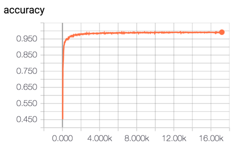
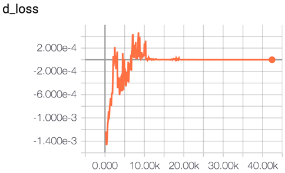
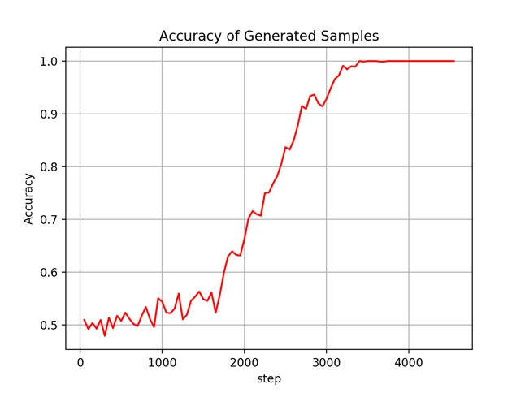
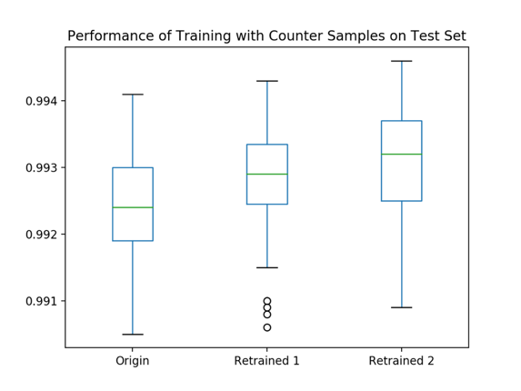
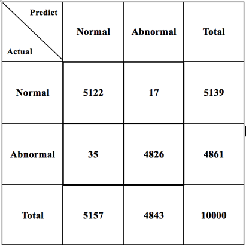
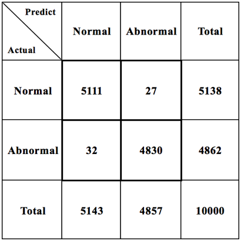
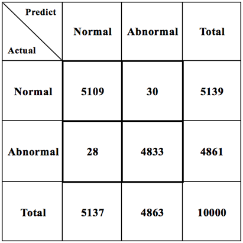
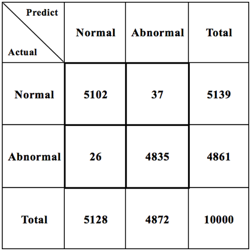

# Abnormal-Flow-Detection-and-Security-Enhancement

Tensorflow implementation of Abnormal Flow Detection and Security Enhancement.

### Abstract

This project has two main idea:

* Detect whether DDoS attacks exist in the network.
* Further improve the recognition accuracy and security of attack detection system.

### Prerequisites

* Python 2.7
* Tensorflow 1.0.0+
* NumPy
* Pandas

### Dataset

[KDDCUP](https://pan.baidu.com/s/1cBBBSM) Dataset is available from baidu disk, includes:

* <code>kddcup.train.data.csv</code>: Train file with label.
* <code>kddcup.test.data.csv</code>: Test file with label.
* <code>kddcup.names.txt</code>: Introduction of abnormal types and features.
* <code>README.html</code>: Detail of KDDCUP dataset.

Create a folder named <code>dataset</code> in the same directory with file <code>preprocess.py</code>.

### Usage

1. Preprocess the train data & test data. Scale continuous features to [0,1] and map symbol features to continuous values.

```
$ python preprocess.py
```

This command will create two files in <code>dataset</code> directory:

* <code>kddcup.train.data.preprocessed.csv</code>
* <code>kddcup.test.data.preprocessed.csv</code>

And these two files are the actual trainset and testset of DNN Classifier and GAN.

2. Train DNN Classifier

```
$ python run_dnn --train
```

This command will save <code>dnn\_logs</code> and <code>dnn\_ckpt</code> while training.

3. Evaluate the DNN Classifier

```
$ python run_dnn --eval
```

This command will show you the accuracy on testset.

4. Train GAN. The GAN model uses CGAN/WGAN and contains Conv1d layers in discriminator and DeConv1d layers in generator.

```
$ python run_cgan --train
```

This command will save <code>cgan\_logs</code> and <code>cgan\_ckpt</code> while training.

5. Generate new samples.

```
$ python run_cgan --generate
```

This command will generate 1280(default) samples and save at <code>dataset/gen\_samples.csv</code>.

6. Test accuracy of generated samples.

```
$ python run_dnn --predict
```

This command will read data from <code>dataset/gen\_samples.csv</code> and calculate the accuracy of these generated samples, to show the performance of the GAN.

7. Generate more samples and filter out the counter samples, mix with the training set, and retrain the DNN Classifier, to obtain better performance on recognition accuracy or the ability to defense DDoS attacks.

### Performance

* Recognition Accuracy of DNN Classifier:

<center></center>

* D_loss of GAN:

<center></center>

* Recognition Accuracy of DNN Classifier on samples which are generated by GAN:

<center></center>

* Accuracy changes while repeating retrain with original training set and counter samples:

<center></center>

* FP and FN changes while repeating retrain with original training set and counter samples:

<center>
 
 
 
 
 </center>